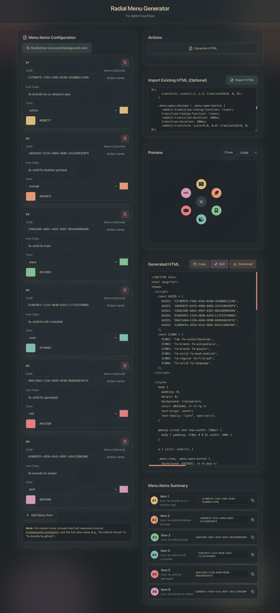
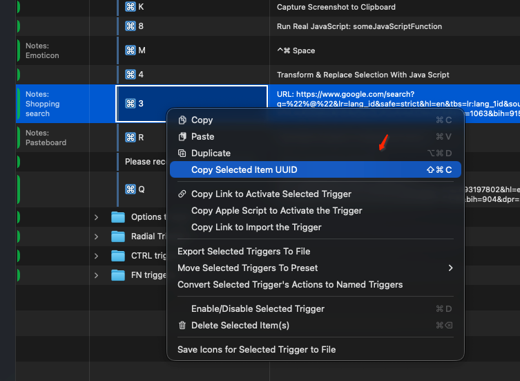
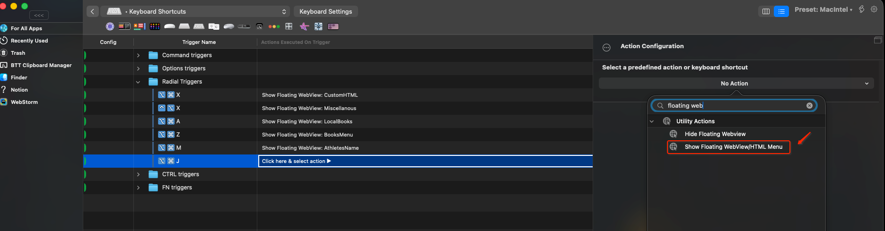
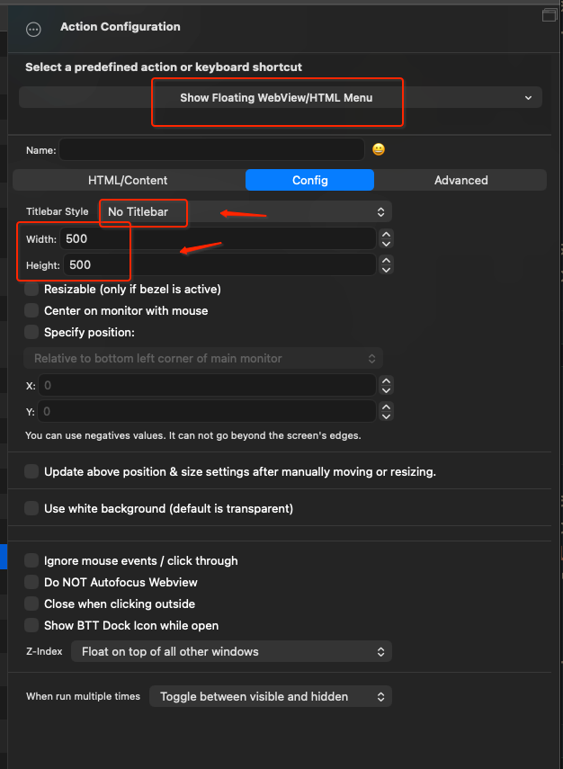

# Radial Menu HTML Generator for BetterTouchTool (Everforest)

Generate a BetterTouchTool **Floating WebView/HTML Menu** radial menu UI, where each menu item triggers an existing BetterTouchTool trigger via its UUID.

## Screenshots




## What this generates

- A single HTML document you paste into BetterTouchTool’s **Show Floating WebView/HTML Menu** action.
- Each menu item becomes a `btt://` URL that runs:
  - `btt://execute_assigned_actions_for_trigger/?uuid=<TRIGGER_UUID>&closeFloatingHTMLMenu=1`

## Requirements

- macOS
- [BetterTouchTool](https://folivora.ai)
- Node.js + npm

## Run the generator locally

```bash
npm install
npm run dev
```

Open `http://localhost:3000`.

## BetterTouchTool setup (step-by-step)

### 1) Create the triggers you want to run

In BetterTouchTool, create the triggers/actions you want the radial menu items to execute (these can be keyboard shortcuts, named triggers, Touch Bar buttons, etc.).

### 2) Copy each trigger’s UUID

Right-click the trigger and choose **Copy Selected Item UUID**.



### 3) Paste UUIDs into the generator

For each radial menu item:

1. Paste the UUID into the **UUID** field (pasting auto-updates the generated HTML).
2. Pick an icon (Font Awesome class) and a color.
3. Click **Generate HTML**, then **Copy** (or **Download**).

### 4) Create a trigger that shows the floating HTML menu

Create a new BetterTouchTool trigger (for example: a keyboard shortcut) that will open the radial menu.

In the trigger’s actions, select the predefined action:

**Show Floating WebView/HTML Menu**



### 5) Configure the floating webview

Recommended settings (you can adjust to taste):

- **Titlebar Style:** No Titlebar
- **Width/Height:** `500 x 500`



### 6) Paste the generated HTML

In the same action configuration, paste the generated HTML into the action’s HTML/Content field, then save.

## Editing an existing menu

If you already have a radial menu HTML snippet:

1. Paste it into **Import Existing HTML (Optional)**.
2. Click **Import HTML**.
3. If the import warns that it’s incomplete, click **Fix HTML** to regenerate a complete template from what could be extracted.

Best results come from importing HTML that was originally generated by this project.

## Notes / limits

- The default fan-out layout is designed for **up to 7 items**. More than 7 items won’t get unique positions unless you extend the CSS transforms in the generated HTML.
- Icons in the generated HTML load via a Font Awesome kit script. If your webview can’t load external resources, icons may not appear.

## Troubleshooting

### Clicking an item does nothing

- Confirm you copied the correct UUID (**Copy Selected Item UUID**).
- Confirm the referenced trigger still exists and has actions assigned.

### The menu is the wrong size

- The generated HTML calls `resize_webview({ width: 500, height: 500 })` inside `BTTInitialize()`.
- Also set width/height in the BetterTouchTool action config to match.

### Icons don’t show

- Check that the webview can load external resources.
- Try a different icon class (e.g. `fa-solid fa-house`).

## BetterTouchTool docs (Folivora)

- Floating WebView basic setup: https://docs.folivora.ai/docs/10_1_webview_basic_setup.html
- Floating WebView appearance & config: https://docs.folivora.ai/docs/10_1_webview_config.html
- WebView lifecycle hooks (e.g. `BTTInitialize`): https://docs.folivora.ai/docs/10_4_webview_lifecycle.html
- Custom URL scheme (`btt://...`): https://docs.folivora.ai/docs/1103_custom_url_scheme.html
